# GODSEYE

**Network intelligence, security operations, monitoring, reporting, and remote support — in one self-hosted platform.**

GODSEYE is built for **small and mid-sized MSPs, IT providers, and organizations** that need strong visibility and useful security tooling without taking on the cost and complexity of a large enterprise stack.

The goal is simple: bring the tools you use every day into one practical platform that you control.

**Self-hosted. Practical. Built for MSPs. Designed with the budget in mind.**

---

## Why GODSEYE

Small and growing MSPs often end up juggling separate products for discovery, monitoring, reporting, security investigations, Windows event collection, ticketing, remote support, email, and maintenance planning.

GODSEYE brings those workflows together so your team can spend less time moving between tools and more time understanding what is happening across the environments you manage.

Use GODSEYE to:

- Discover and track devices across managed networks.
- Monitor systems, websites, services, and network health.
- Investigate security findings and recurring failures.
- Review Windows Event findings from enrolled computers.
- Run built-in Cyber Tools for authorized security checks.
- Generate professional operational and security reports.
- Create and manage tickets from findings.
- Plan maintenance work with the built-in calendar.
- Connect supported email providers for operational workflows.
- Provide consent-based Windows remote support.
- Monitor the GODSEYE appliance itself.
- Keep your infrastructure and data under your control.

---

## See GODSEYE in action

The gallery shows captures from the running app with representative sample data. Counts, findings, devices, and tickets shown here are examples, not live production results.

### Dashboard

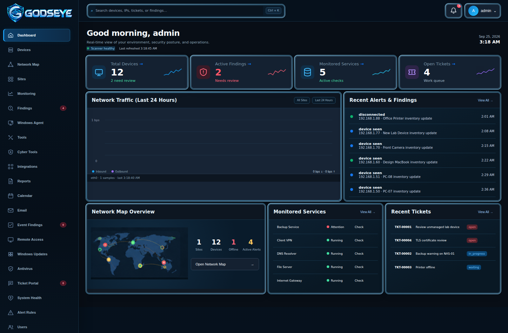

**How it works:** The Dashboard gives you a quick view of device totals, security findings, traffic, monitored services, tickets, and appliance health. Select a summary or card to open the related workspace. The Network Map preview lets you switch between topology and geographic views before opening the full map.

### Devices and inventory

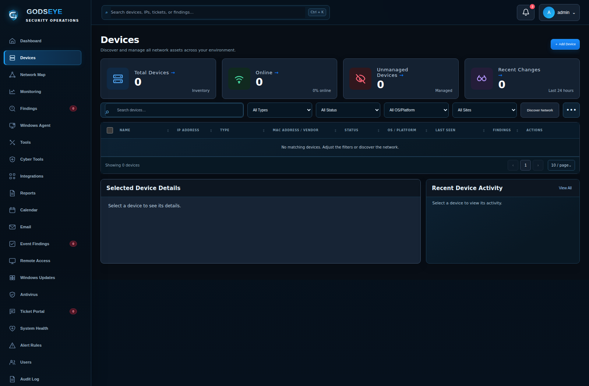

**How it works:** Search by device or address and filter the inventory by type, status, platform, or site. Open a device to review its identity, classification, first and last seen information, history, findings, and recent activity. Devices that discovery has not found can also be added manually.

### Network Map

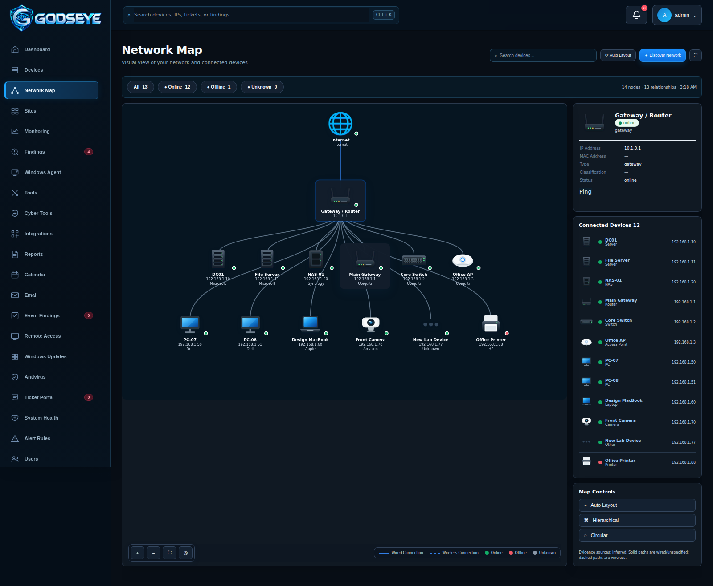

**How it works:** Network Map turns collected discovery evidence into a visual view of devices and observed relationships. Select a device from the map to continue the investigation in its inventory record.

### Calendar and maintenance planning

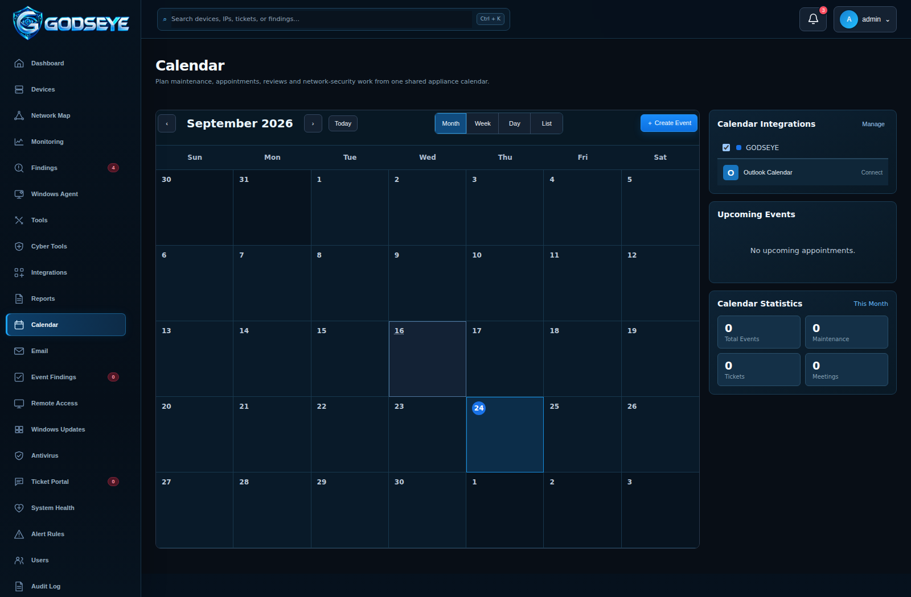

**How it works:** Use Month, Week, Day, or List views to plan maintenance, reviews, appointments, and ticket work. Events can be created locally, linked to tickets, or synchronized with supported calendar providers after authorization.

### Email workspace

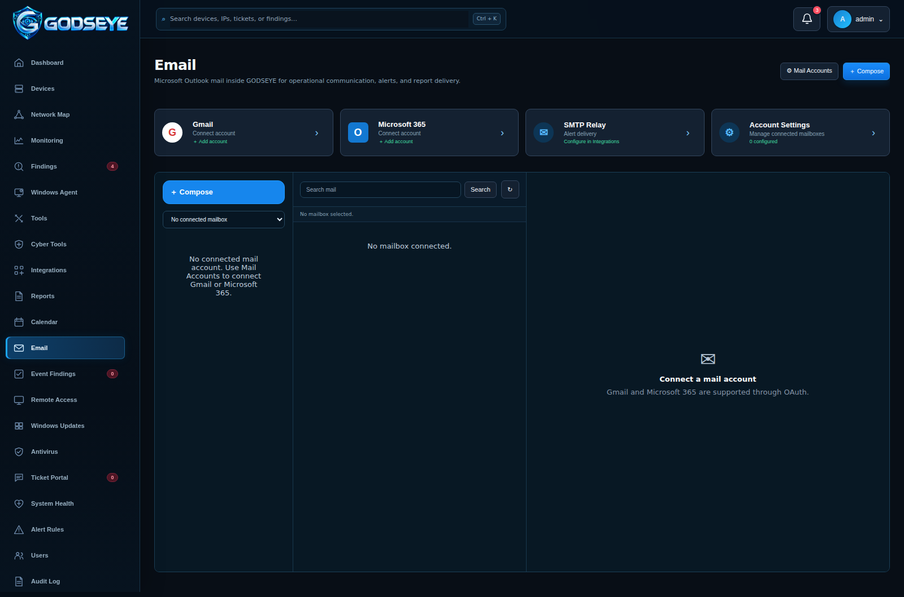

**How it works:** Connect a supported mailbox, browse folders, search messages, read and respond to email, and send generated GODSEYE reports from the same operational workspace. SMTP relay settings are available separately for automated notifications.

### System Health

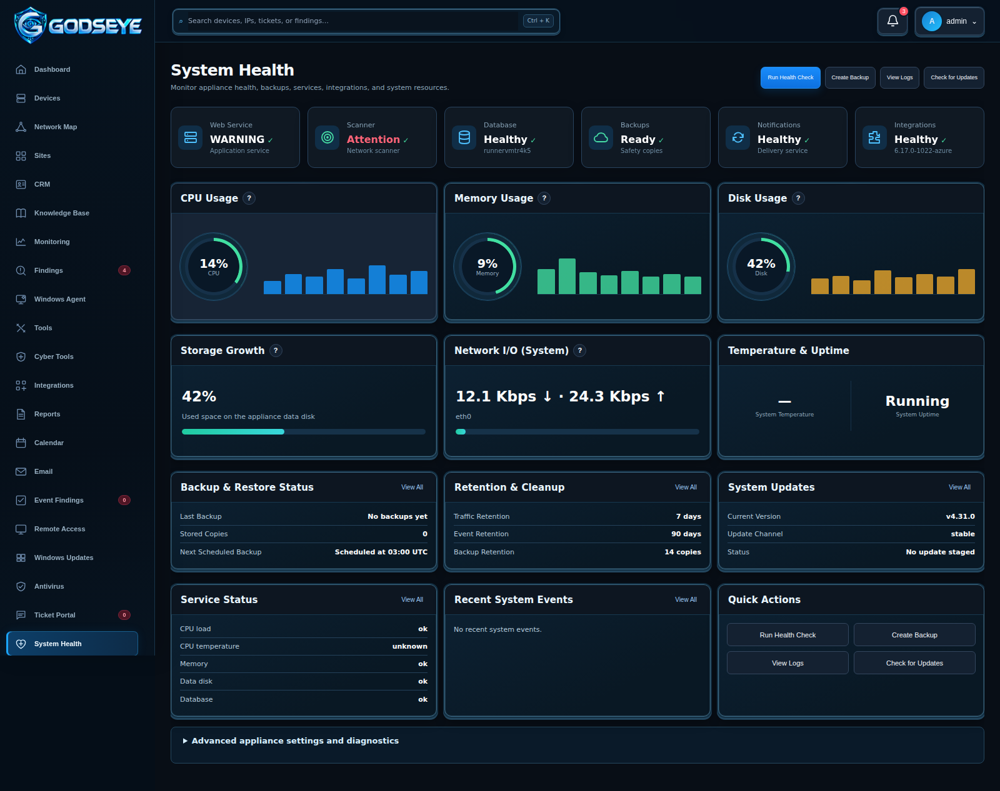

**How it works:** System Health gives administrators one place to review the appliance, scanner, database, backups, integrations, CPU, memory, disk usage, storage growth, network activity, temperature, and uptime. Health checks, logs, backups, retention, services, and update controls are available from the same area.

### Remote Access

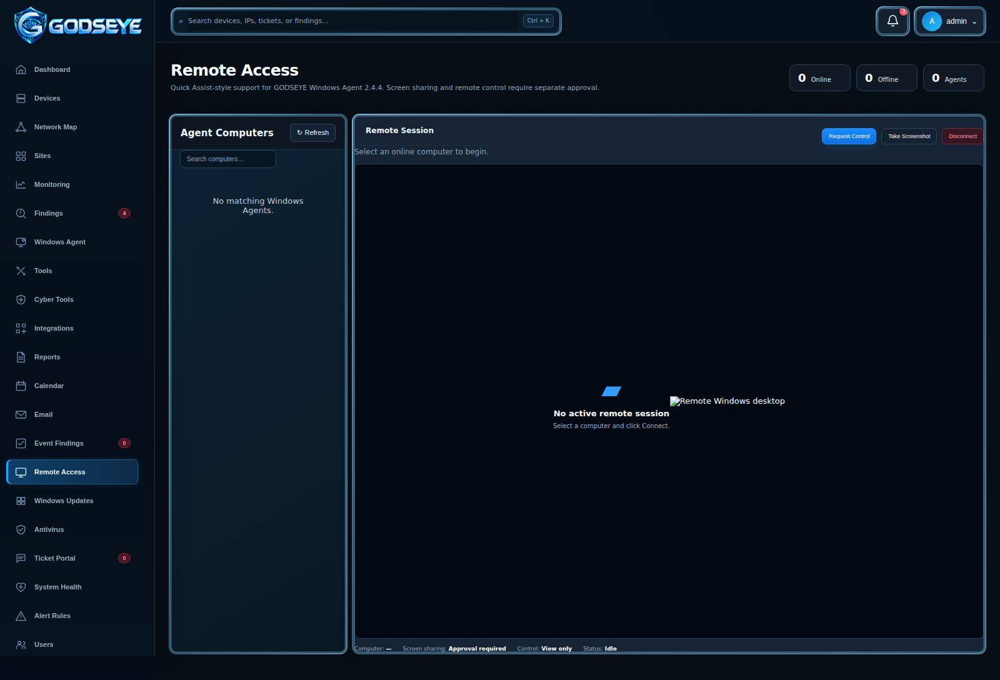

**How it works:** Enroll a Windows computer with the GODSEYE Agent, select an online system, and request a remote session. The person at the Windows computer must approve screen sharing before the session begins. Sessions start view-only, and remote keyboard or pointer control requires a separate approval. Either side can end the session.

### Windows Event Findings

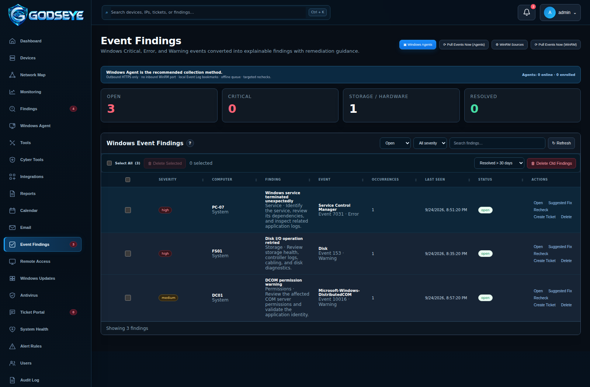

**How it works:** Enrolled Windows computers can send selected Critical, Error, and Warning events to GODSEYE over HTTPS. Repeated events are grouped into findings so technicians can review the message, use Suggested Fix guidance, recheck the condition, resolve the finding, or create a ticket.

### Cyber Tools

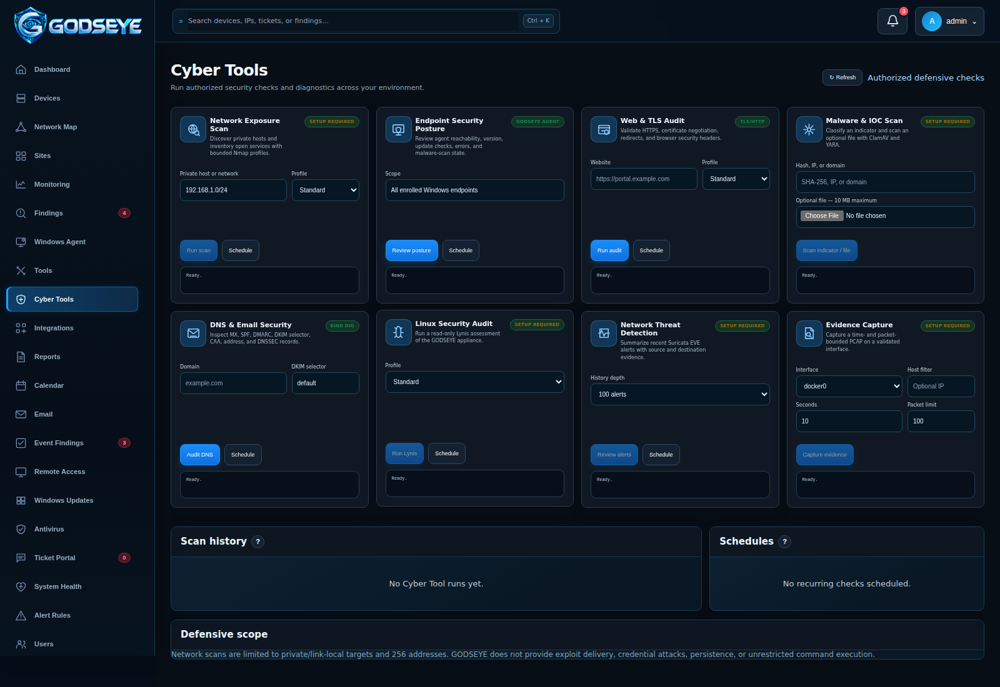

**How it works:** Cyber Tools provides focused security and troubleshooting utilities for systems you own or are authorized to administer. Each card contains its target, available options, run controls, and structured result.

| Tool | What it does |
| --- | --- |
| Network Exposure Scan | Runs bounded network discovery and port checks against an authorized private host or network. |
| Endpoint Security Posture | Reviews enrolled Windows endpoint reachability, agent health, updates, errors, and security state. |
| Web & TLS Audit | Reviews HTTPS, certificates, redirects, and important web security headers. |
| Malware & IOC Scan | Checks supported hashes, IP addresses, domains, and uploaded files with configured security engines. |
| DNS & Email Security | Reviews MX, SPF, DMARC, DKIM, CAA, address records, and related DNS security information. |
| Linux Security Audit | Runs a read-only security assessment of the GODSEYE appliance using the configured audit engine. |
| Network Threat Detection | Reviews alerts from an existing supported network-threat feed. |
| Evidence Capture | Captures a bounded packet sample from a validated network interface for troubleshooting or evidence collection. |

After a run, review the structured result and scan history. Where supported, results can be turned into Findings or Tickets, exported, or scheduled for another check.

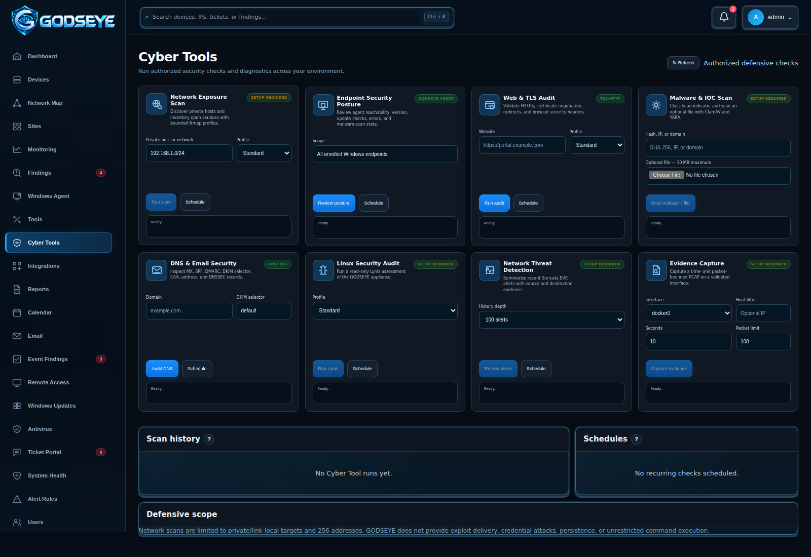

### About GODSEYE

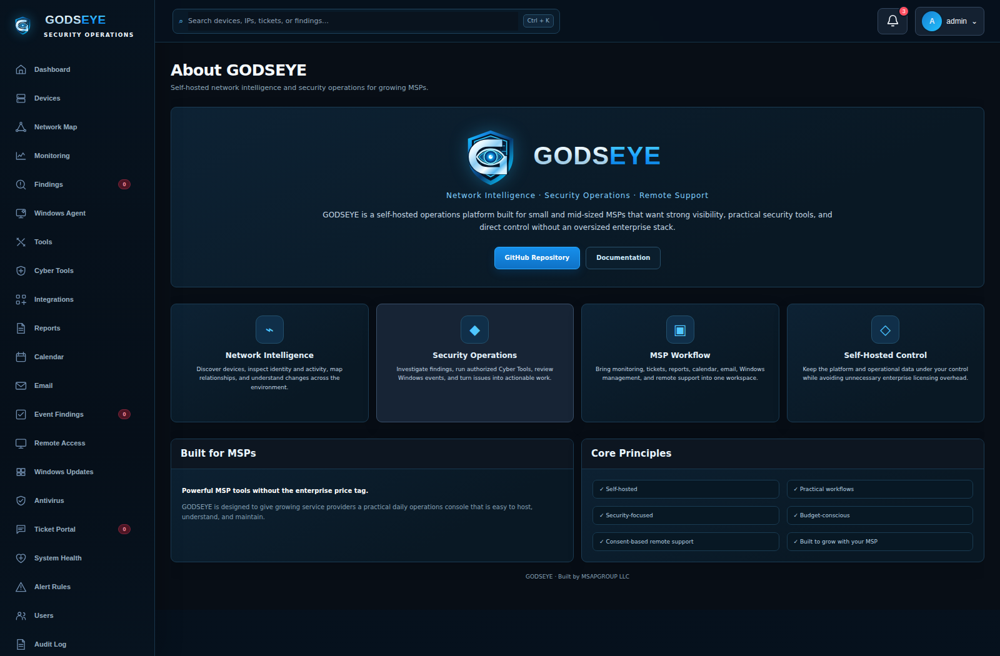

**How it works:** About GODSEYE presents the platform identity, MSP-focused mission, core capabilities, self-hosted operating model, and direct links to the project repository and documentation. It uses the same approved shield/G/eye branding and visual system as the rest of the application.

---

## Designed for day-to-day MSP operations

GODSEYE is not just a passive device list. It is designed as an operator-facing platform that connects discovery, monitoring, diagnostics, findings, tickets, reporting, remote support, integrations, and administration.

A typical workflow can look like this:

1. **Discover** devices on the managed network.
2. **Classify** known equipment and investigate anything unfamiliar.
3. **Monitor** important systems, services, websites, and infrastructure.
4. **Investigate** findings, device changes, and recurring failures.
5. **Use Cyber Tools** when deeper troubleshooting or authorized security checks are needed.
6. **Create a Ticket** when work needs to be assigned or tracked.
7. **Schedule the work** on Calendar when maintenance or follow-up is required.
8. **Use Remote Access** when an enrolled Windows user approves a support session.
9. **Generate Reports** for internal review or client communication.
10. **Review System Health** to make sure the GODSEYE appliance itself remains healthy.

---

## Network intelligence and device management

GODSEYE helps answer practical questions such as:

- What is connected right now?
- What new device just appeared?
- Which known device changed addresses?
- What systems went offline or came back online?
- Which services are failing repeatedly?
- Are DNS, reachability, or packet-loss issues recurring?
- Which findings need investigation?
- What changed while nobody was watching?

Core network capabilities include:

- Device discovery and inventory
- First-seen and last-seen tracking
- Device classification and friendly naming
- Address and status history
- New-device and reconnect events
- Network topology
- Device-focused findings and diagnostics
- Bounded network tools
- Service and website monitoring
- Alert rules
- Traffic-source integrations
- Audit history

---

## Monitoring and findings

GODSEYE turns repeated operational problems into findings your team can work.

Monitoring can cover configured services, websites, infrastructure, device availability, DNS behavior, reachability, and other supported conditions. Findings can then be reviewed, rechecked, resolved, or converted into tickets.

Alert rules can be used for conditions such as device bursts, offline duration, address changes, reconnect activity, scanner health, and other operational events.

---

## Windows management

### Windows Agent

The GODSEYE Windows Agent is the recommended way to connect supported Windows workstations and servers.

Enrollment uses a one-time token created from GODSEYE. After enrollment, the agent keeps its identity and protected credentials on the Windows computer so normal reinstall or upgrade operations can preserve the enrolled system.

The agent communicates outbound to GODSEYE over HTTPS and can support:

- Windows Event collection
- Agent health and status
- Operator-requested event collection
- Endpoint posture information
- Consent-based remote support

The Windows Agent does not provide an unrestricted remote shell.

### Windows Event Findings

The agent reads selected Critical, Error, and Warning Windows Event records locally and sends them to GODSEYE. Recurring events are grouped into findings to reduce noise and give technicians a clearer operational view.

A finding can include:

- Event details
- Suggested Fix guidance
- Documentation links
- Recheck
- Resolve
- Create Ticket

WinRM can also be used as an agentless fallback where appropriate, but the Windows Agent is the preferred path.

### Consent-based Remote Access

Remote support is designed around local-user approval.

A remote session requires the user at the Windows computer to approve screen sharing. The session begins in view-only mode. Keyboard and pointer control require an additional approval.

The remote channel is limited to the supported screen, pointer, keyboard, and wheel operations. The local user can stop sharing, and the GODSEYE operator can disconnect the session from the portal.

---

## Ticket Portal

Ticket Portal helps MSP teams move from detection to tracked work.

Tickets can be created manually or from supported Findings and Event Findings. They can include:

- Priority
- Assignee
- Status
- Work notes
- Linked devices or findings
- Calendar scheduling
- Resolution and closure tracking

Ticket assignees come from GODSEYE application users, helping keep operational ownership inside the platform.

---

## Reports

GODSEYE can generate reports for operational review and client communication, including:

- Network Summary
- Device Inventory
- Security Findings
- Availability and Monitoring
- Integrations Health
- Traffic Usage
- Audit Activity
- Device Changes

Supported reports can be exported to common formats, and generated reports can be shared through a connected mailbox where configured.

---

## Integrations

GODSEYE supports integrations that add network, infrastructure, communication, and operational context.

Depending on your environment, integrations can include supported:

- DNS and filtering platforms
- Network controllers
- SNMP-capable infrastructure
- Traffic sources
- Gmail
- Microsoft 365
- Google Calendar
- Microsoft calendars
- Webhooks
- ntfy
- SMTP delivery

Integration availability depends on the software and services configured on your appliance.

---

## Movable dashboard and workspace cards

Supported GODSEYE pages allow users to rearrange cards and navigation for their own workflow.

Use the layout controls to:

- Reorder supported page cards.
- Reorder sidebar navigation.
- Move items between supported navigation groups.
- Reset the page layout.
- Reset the sidebar layout.

Layouts are saved for the signed-in user, so one technician's preferred arrangement does not overwrite another user's layout.

---

## Built-in network tools

The authenticated Network Tools workspace includes practical troubleshooting and administration functions such as:

- Ping
- Traceroute
- DNS Lookup
- Bounded TCP Port Scan
- Device Information
- Network Discovery
- Wake-on-LAN
- Gateway checks
- Internet checks
- Website monitoring

Network scanning functions are constrained to appropriate authorized targets where applicable.

---

## Traffic visibility

GODSEYE only reports traffic information that the configured source can actually observe or provide.

A Raspberry Pi or Linux appliance connected as a normal LAN client cannot automatically see all traffic moving between every other client and the router.

Per-device traffic visibility can come from supported sources such as:

- Controller counters
- Attributable SNMP data
- SPAN or mirrored switch ports
- Inline or gateway deployments

Choose the traffic source that matches the network you manage.

---

## Security model

GODSEYE is designed as a local-first, self-hosted platform.

The web application runs under an unprivileged service account, while privileged collection functions are separated into services that receive only the permissions needed for their job. Protected integration credentials and secrets are encrypted at rest with the appliance key.

Security controls include:

- Session protection
- CSRF defenses
- Security headers
- Account lockout
- Password controls
- TOTP multi-factor authentication with backup codes
- Role-based permissions
- Audit history
- Protected secrets
- Controlled administrative actions

Supported roles include administrators, operators, auditors, and read-only users.

GODSEYE is intended for trusted LAN or VPN access. Do not expose the application directly to the public Internet. HTTPS can be configured through the included reverse-proxy helper.

---

## Installation

GODSEYE installs directly on supported Raspberry Pi OS, Debian, or Ubuntu-style Linux systems using systemd. Docker is not required.

### Storage recommendation

For continuous monitoring, SSD or NVMe storage is strongly recommended.

Faster storage improves:

- Database activity
- Dashboard response
- Log processing
- Report generation
- Updates
- Backups
- Evidence capture

SD-card and hard-drive installations can work, but SSD-class storage is the better choice for a production MSP appliance.

### Fresh install

Extract the GODSEYE server package into a working directory:

    mkdir -p ~/godseye
    unzip GODSEYE-server*.zip -d ~/godseye
    cd ~/godseye
    chmod +x install.sh
    sudo ./install.sh --fresh

When installation completes, open:

    http://YOUR-GODSEYE-IP:8080

The built-in administrator username is **admin**.

GODSEYE ships with **no default admin password**. The first-run setup page requires you to create one.

### Upgrade an existing appliance

Extract the new GODSEYE server package into a temporary directory and run:

    chmod +x install.sh
    sudo ./install.sh --upgrade

The upgrade process preserves the GODSEYE data and configuration directories and performs the required migration and backup checks before starting the updated application.

### Useful maintenance commands

    sudo ./install.sh --doctor
    sudo systemctl status godseye-web
    sudo systemctl status godseye-scanner
    sudo journalctl -u godseye-web -n 100 --no-pager

The web service listens on port **8080** by default. HTTPS can be placed in front of it with the included reverse-proxy helper.

---

## Data and backups

The primary GODSEYE database is stored under the appliance data directory and uses SQLite with write-ahead logging.

GODSEYE supports:

- Integrity-checked backups
- Pre-restore safety backups
- Retention controls
- Configuration portability
- Protected application secrets
- Backup and restore administration from the platform

Before major changes, keep a current verified backup of the appliance.

---

## Updates and production operation

GODSEYE supports staged application updates with integrity verification and preflight checks.

Production controls include:

- Scheduled backups
- Retention policies
- Configuration export and import
- Notification delivery history
- HTTPS setup
- Audit search and export
- Confirmation-gated administrative actions

Updates preserve the GODSEYE data directory and configuration and create a safety backup before application files are replaced.

---

## Development and testing

For local development:

    python3 -m venv .venv
    source .venv/bin/activate
    pip install -r requirements.txt
    PYTHONPATH=. pytest -q
    python -m compileall app

Hardware-dependent behavior should also be validated on the target appliance, particularly privileged packet collection, system services, thermal information, and real infrastructure integrations.

---

## Documentation

Additional documentation is available under the **docs** directory, including:

- Installation and usage guidance
- Windows Agent documentation
- Cyber Tools configuration
- Appliance hardening
- Discovery and topology
- Integrations and reporting
- Production management
- Screenshot gallery and capture notes

See the [complete screenshot gallery](docs/SCREENSHOTS.md) for additional GODSEYE interface views.

---

## Built for MSPs without forgetting the budget

GODSEYE is designed for MSPs that want useful visibility and security capabilities without building their operations around a collection of expensive enterprise products.

It gives small and mid-sized teams a practical platform they can host, understand, operate, and grow with.

**GODSEYE — Powerful MSP tools without the enterprise price tag.**

---

## Authorized use

Deploy GODSEYE only on networks and systems you own or are authorized to administer, monitor, test, or support.

Review the repository license before redistribution.
