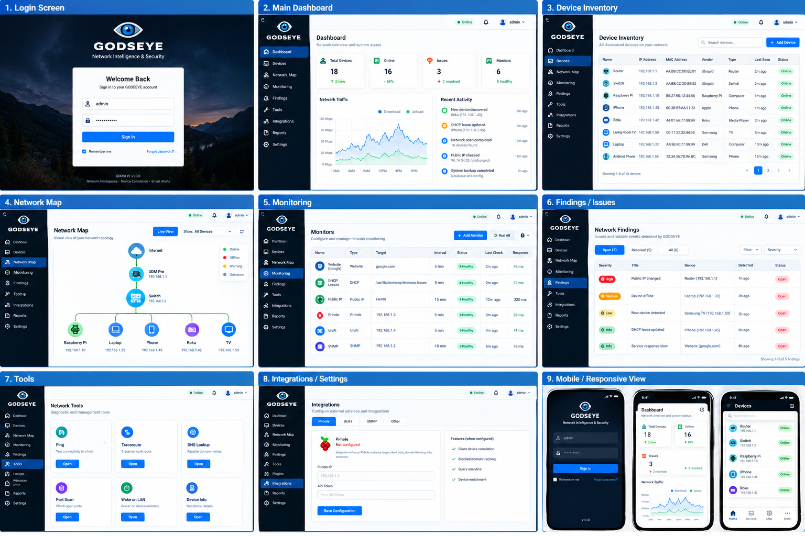

## v1.5 Dashboard Visualization & Appliance Hardening

GODSEYE now samples live RX/TX traffic from the Raspberry Pi default network interface, renders live traffic and client-activity views, provides richer relationship-aware topology, exports reports to PDF/CSV, protects Prometheus with browser authentication or a rotatable API key, encrypts integration/SMTP credentials at rest, manages integrity-checked database backups/restores, automatically applies retention policies, and provides a Raspberry Pi self-diagnostic page. See `DASHBOARD_HARDENING_RELEASE_NOTES.md` and `docs/APPLIANCE_HARDENING.md`.

# GODSEYE

GODSEYE is a local-first Raspberry Pi 4 network monitoring, discovery, diagnostics, and troubleshooting appliance.

## This working copy

This distribution keeps the existing GODSEYE authentication, MFA, device inventory, event history, alert rules, notifications, scanner health, and privilege separation.

### Device Intelligence block

This build adds a device-centric intelligence workflow: click **Details** in Device Inventory to see identity, evidence sources, IP history, recent events, open findings, risk scoring, recommendations, live diagnostics, and an administrator recheck action. Successful ARP observations are now recorded as intelligence evidence so the history grows automatically with normal scans.

### Included now

- ARP discovery with `arp-scan`
- Reverse DNS enrichment
- ICMP cross-checks
- Persistent SQLite/WAL inventory
- New/disconnect/reconnect/IP-change events
- Device classification
- Alert rules
- ntfy/email/webhook notifications
- Session authentication and TOTP MFA
- Admin/read-only roles
- CSRF/security headers/account lockout
- Privilege-separated web and scanner systemd services
- Native plugin registry and scheduler
- Nmap local-network discovery
- IPv4/IPv6 neighbor discovery
- Local hostname lookup
- Read-only gateway and Internet diagnostics
- Host troubleshooting and evidence-based recommendations
- Authenticated `/tools` diagnostics page
- Feature-parity manifest for planned integrations
- Basic automated tests

## Screenshots



See [docs/SCREENSHOTS.md](docs/SCREENSHOTS.md) for the walkthrough.

## Fresh Raspberry Pi installation

```bash
sudo apt update
sudo apt install -y git
git clone https://github.com/msapgroup/Godseye.git /tmp/godseye-install
cd /tmp/godseye-install
sudo bash install.sh
```

The installer installs the required Raspberry Pi packages, copies the checked-out release into `/opt/godseye` (it does not clone the repository a second time), creates the `godseye` service account, installs the web/scanner systemd services, validates the application import before starting services, and creates a random initial admin password if one was not supplied. Optional tools are installed when available. Use `sudo bash install.sh --doctor` for diagnostics.

After installation:

```bash
sudo systemctl status godseye-web
sudo systemctl status godseye-scanner
```

Open the Pi's web address on your LAN. The exact listener/port is defined by the systemd configuration in this release.

## Diagnostics

After logging in, open:

```text
/tools
```

Available read-only tools include:

- Host ping and packet-loss diagnosis
- DNS resolution
- Gateway test
- Internet connectivity test
- IPv4/IPv6 neighbor discovery
- Nmap discovery of private/link-local networks

Nmap targets are deliberately restricted to private/link-local networks by the API.

## Development and testing

```bash
python3 -m venv .venv
source .venv/bin/activate
pip install -r requirements.txt
PYTHONPATH=. pytest -q
python -m compileall app
```

The working copy was locally verified with Python compilation, application import, and three smoke tests.

## Security model

The web service runs as the unprivileged `godseye` account. Only the scanner service runs as root because ARP scanning requires elevated privileges. The application is intended for trusted LAN/VPN access and should not be exposed directly to the public Internet.

## Documentation

- `docs/USAGE.md` — installation and how-to guide
- `docs/netalertx-parity.md` — feature parity roadmap
- `docs/screenshots/` — current UI documentation images

## Roadmap

The plugin architecture is prepared for additional native integrations including DHCP, Pi-hole, UniFi, SNMP, router APIs, mDNS/NetBIOS enrichment, website/service monitoring, Wake-on-LAN, workflows, MQTT, Prometheus, reports, and additional notification providers.

These are tracked as implementation work; they are not represented as complete merely because they appear in the capability manifest. The screenshot walkthrough is a product/UI presentation aid and is labeled accordingly.

## Native network tools and integrations

The working build is Docker-free and includes authenticated endpoints for Nmap LAN discovery, IPv4/IPv6 neighbor discovery, host/gateway/Internet diagnostics, website monitoring, Pi-hole testing, UniFi testing, SNMP testing, and Wake-on-LAN. See `docs/GITHUB_RELEASE.md` and `docs/USAGE.md` for deployment and usage.

## Monitoring + Findings Remediation (v1.2)

GODSEYE now supports persistent monitor Add/Edit/Delete/Run controls and creates explainable Findings after repeated service, reachability, packet-loss, and DNS failures. Findings expose Suggested Fix, Recheck, and Resolve actions. Scanner state transitions also create offline/IP-change findings. Recovery checks automatically close matching health findings where appropriate.

GODSEYE deliberately keeps remediation operator-guided: Suggested Fix does not make destructive router, firewall, DNS, or device changes automatically.

## v13 Full Discovery + Topology

GODSEYE can now correlate ARP, Nmap, Linux neighbors, mDNS, NetBIOS, DHCP, reverse DNS, and configured Pi-hole, UniFi, and SNMP observations into one device identity. Manual **Scan Now** requests run the full enrichment pipeline, and the Network Map reads the live topology model. See `docs/DISCOVERY_TOPOLOGY.md`.

## v14: Integrations + Reporting

GODSEYE now includes persistent Pi-hole, UniFi and SNMP configuration, background synchronization into the shared topology/device intelligence store, client/query analytics, a count-only Prometheus `/metrics` endpoint, generated/scheduled network-summary reports, and webhook/ntfy/SMTP notifications tied to findings and topology changes.

Integration and SMTP secrets are masked from all read APIs after saving. They are stored locally in the protected GODSEYE SQLite database; v14 does not claim application-level encryption. See `docs/INTEGRATIONS_REPORTING.md` for configuration and security notes.


## v1.6 production appliance management
GODSEYE now includes controlled staged software updates, configuration export/import, scheduled automatic backups, notification retry history, Nginx HTTPS setup, admin/operator/auditor/read-only permissions, searchable/exportable audit data, and confirmation-gated Pi-hole/UniFi remediation. See `docs/PRODUCTION_MANAGEMENT.md`.


## v1.8.0 UI cleanup and live dashboard fixes
- Dashboard live traffic, recent activity, client activity and device list now load independently so one failed widget cannot blank the others.
- Device inventory opens a dedicated device page instead of a modal. The page has a Back to Devices control and URL hash deep-linking.
- Removed the legacy Device Intelligence modal from the document flow.
- Dashboard monitor counts are now live instead of hard-coded.
- Traffic collection has a safer Linux-interface fallback for Raspberry Pi appliances.
- Dashboard responses are sent with no-cache headers to avoid stale JavaScript after upgrades.
- Visual cleanup follows the dense, table-driven network-appliance interaction model used by NetAlertX, while retaining GODSEYE branding and original code.


## v1.9.0 — Screenshot UI Stability

Version 1.9.0 is a front-end stability release. It restores dashboard boot, Scan Now, administration pages, independent live dashboard panels, and a dedicated device-detail page with back navigation. The login/dashboard styling is aligned with the GODSEYE reference mockups. See `UI_STABILITY_RELEASE_NOTES.md`.

## Device friendly names

GODSEYE lets administrators assign a friendly name to any discovered device and rename known devices later. Use **Name/Rename** in Device Inventory or **Rename Device** on a device details page. Scanner rediscovery preserves the friendly name.

## Pi-hole v6 authentication

For Pi-hole v6, use a Pi-hole **Application Password** as the GODSEYE Pi-hole credential. GODSEYE exchanges the application password for a temporary SID at `/api/auth` and uses that session for protected API calls. Existing SIDs and legacy Pi-hole v5 API tokens are retried automatically for compatibility. If your Pi-hole HTTPS endpoint uses its default self-signed certificate, disable **Verify TLS certificate** for that integration.

## v2.3.0 — Device Identity & Classification

Device Inventory now exposes device classification directly, including a Classify action for setting device type and lifecycle state. Device Details now lets administrators edit Hostname and Type and choose Classification from New, Investigate, Known, Managed, or Ignored. See `DEVICE_IDENTITY_CLASSIFICATION_RELEASE_NOTES.md`.

## v2.4.0 — Device Icons

Device Inventory now uses recognizable device icons instead of the generic dot. GODSEYE can infer an icon from the saved device Type, administrators can choose from built-in Router/Switch/AP/PC/Laptop/Server/NAS/Camera/Printer/Phone/Tablet/TV/Game Console/IoT icons, and optional PNG/JPEG/WebP custom icons up to 256 KB can be saved per device. Icons also appear on the dashboard device list and device details header.

## v2.5.0 — Realistic Device Icon Picker

Device icons now use shaded hardware-style illustrations and the icon editor opens as a centered modal overlay with device preview and category tabs. Additional Firewall, Modem, VoIP Phone, Network Storage, and Patch Panel presets are included. See `DEVICE_ICONS_REALISTIC_MODAL_RELEASE_NOTES.md`.


## v2.6.0 — Realistic Network Map

The Network Map now uses the realistic device icon library, status-aware topology links, filters, search, selectable device details, connected-device lists, and multiple layout modes.

## v2.7.0 — Device Icon Picker Fix

The device icon selector now opens on **All Icons**, displays the full realistic icon library, and uses cache-busted asset URLs so upgraded installations do not show stale older artwork.
