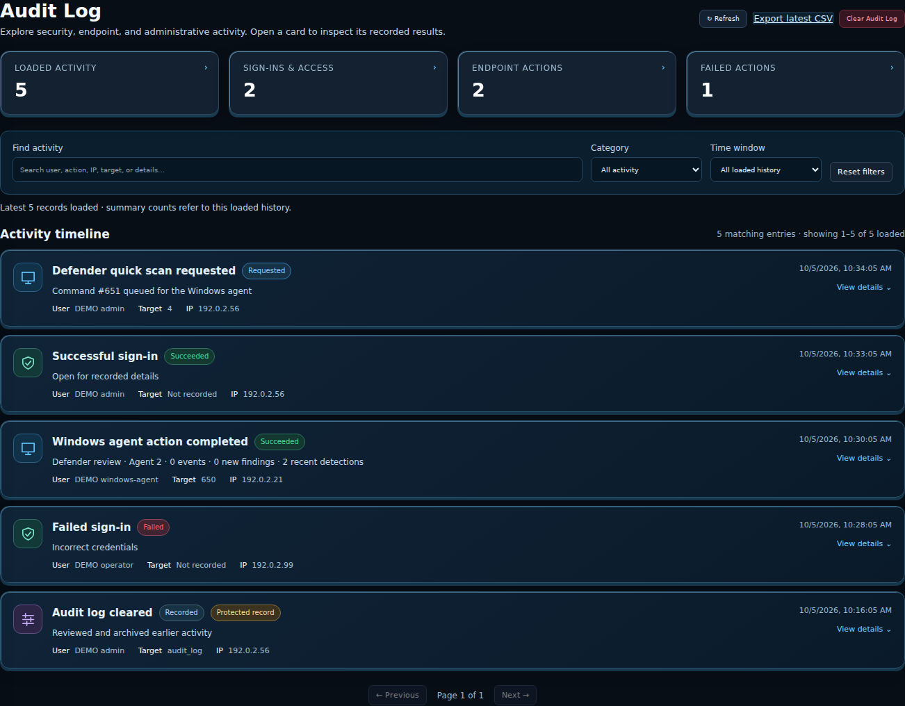
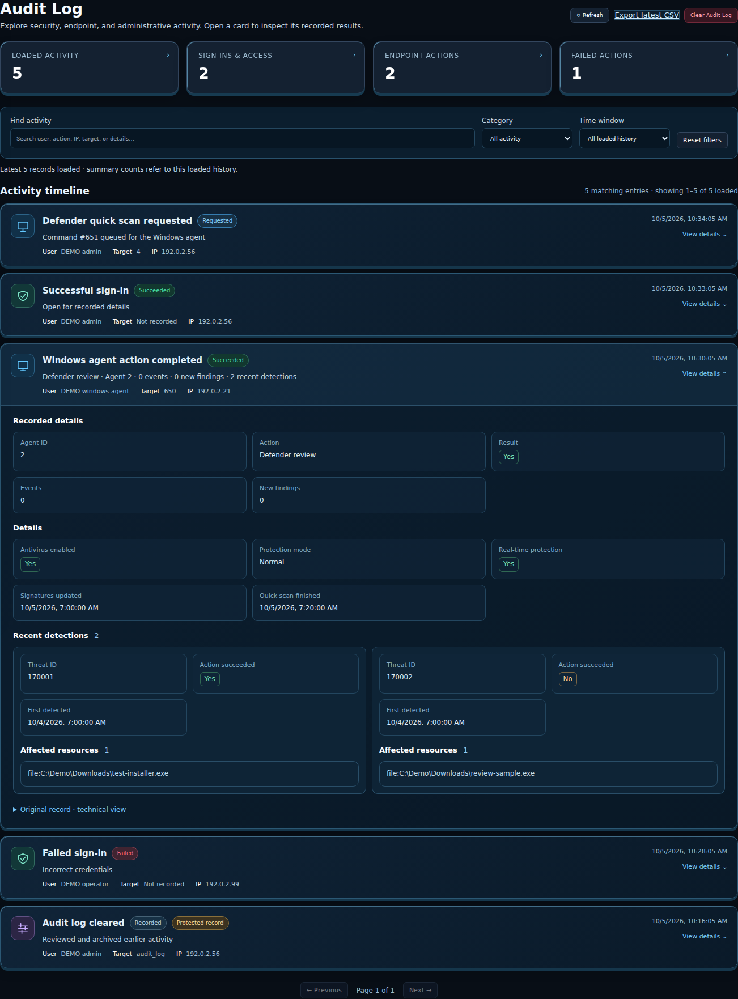

# Audit Log

Open **Audit Log** from the sidebar to review sign-ins, endpoint actions, and administrative activity recorded by GODSEYE.

## Find an activity

1. Select **Loaded Activity**, **Sign-ins & Access**, **Endpoint Actions**, or **Failed Actions** to filter the timeline.
2. Enter a keyword in **Find activity**. Search includes the recorded user, action, IP address, target, and details, including nested agent results.
3. Use **Category** and **Time window** to narrow the results. Select **Reset filters** to clear your choices.
4. Use **Previous** and **Next** to browse 25 records at a time. Select **Refresh** to fetch the latest records.

The view loads up to the latest 500 records. Counts, searches, and time windows apply to this loaded history, not the entire database. Dates display in your browser's local time. If loading fails, an unavailable message appears; this does not mean your audit history was deleted.

## Read an activity card

Click the card or use **Tab**, then **Enter** or **Space**, to expand its recorded details. The card shows its action, recorded outcome, user, target, IP address, and time. Missing fields say **Not recorded**.

Nested Windows Agent and Defender results appear as labeled fields, boolean badges, dates, and individual detection cards. Expand **Show more** for long lists. These fields reflect the stored report; a successfully completed command is not a guarantee that a computer is free of malware.

Expand **Original record · technical view** to inspect the action code, record ID, and original recorded details. GODSEYE formats the presentation without rewriting the stored audit evidence.

## Export and access

**Export latest CSV** downloads up to 2,000 latest audit records, independently of the active display filters. Sidebar access follows the role's configured Audit Log permission. Only administrators can clear audit logs. Clearing still requires a reason and preserves the protected clear record for seven days. Protected records are marked on their cards.

The screenshots contain demonstration users, reserved documentation IP addresses, and sample file paths. Your server shows its own recorded activity.
