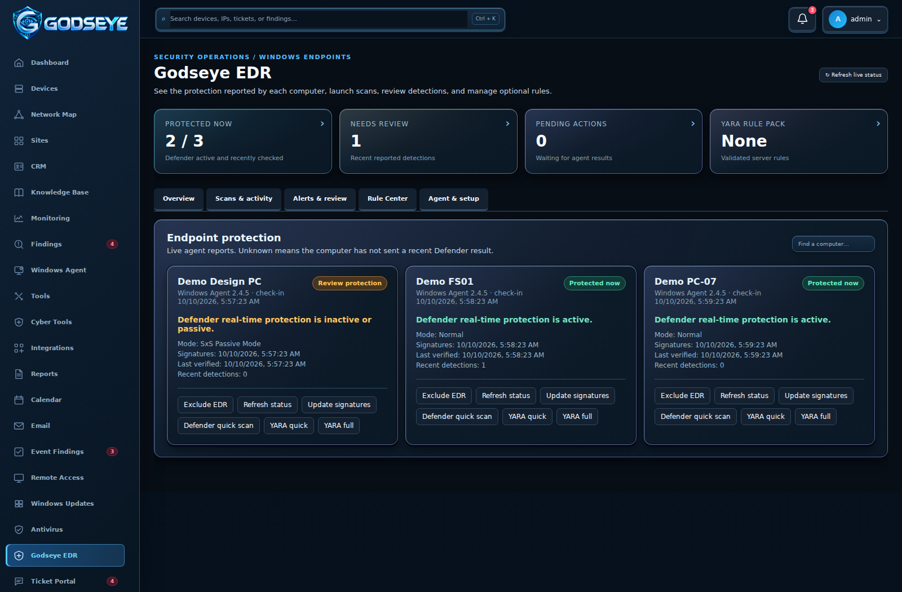
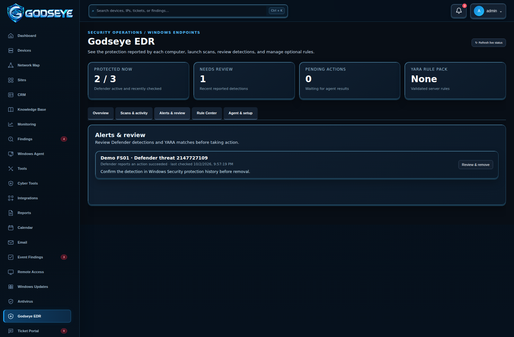
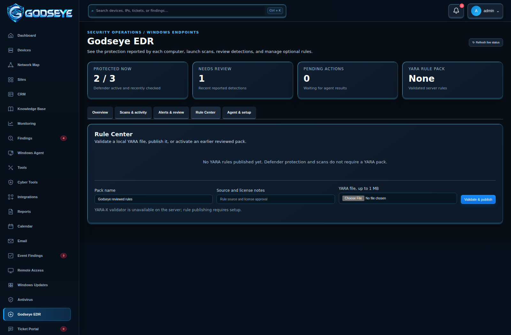

# Godseye EDR

Godseye's EDR page manages two complementary Windows capabilities:

- **Microsoft Defender Antivirus:** when active on the PC, Defender provides real-time antivirus protection and its own security intelligence updates and remediation. Godseye displays the reported state and recent detection history; it does not supply Defender's signatures.
- **Optional YARA-X:** approved rule packs support on-demand quick and full scans. Rule matches require technician review. YARA scanning is not continuous antivirus protection.

The endpoint must have Agent 2.5.0 or newer for status, quick scans, and YARA scans. Agent 2.5.1 adds a queued **Update signatures** command. The core remote-support agent remains available if Godseye EDR is excluded. The server does not mark an agent protected merely because EDR is selected; Defender real-time protection must report active in a recent check-in.

## How to use it

*Screenshot uses labeled demonstration endpoints; live values come from each Windows Agent.*

The page follows the approved EDR workspace layout: summary numbers at the top and separate **Overview**, **Scans & activity**, **Alerts & review**, **Rule Center**, and **Agent & setup** tabs. The counts and cards are populated from enrolled computers rather than fixed demonstration data. Search in Overview filters the endpoint cards by computer name.

**Alerts & review** lists recent Defender detections and reported YARA matches. The **Review & remove** action uses Defender's removal command after confirmation; the page does not claim to have a separate Godseye quarantine engine. **Scans & activity** shows each queued action and a readable result instead of raw command JSON.

**Rule Center** accepts a local reviewed YARA file, checks it with the server validator, and keeps earlier validated packs available for activation or rollback. **Agent & setup** links to the existing Windows Agent enrollment flow and explains the optional scanner component.

1. Open **Godseye EDR** as an administrator and choose **Enable EDR** on the Windows endpoint. Defender status is requested automatically at most once every five minutes while the endpoint is connected. A stale or missing result reads **unknown**.
2. Read **Defender real-time active**, **inactive or passive**, or **unknown** in the endpoint card. Check the running mode, last signature update, recent detection IDs, and the time Godseye checked. Choose **Refresh status** to request another reading.
3. When enabled, Godseye also asks the Agent to read warning and error events from the Windows Defender Operational log. These flow into **Windows Event Findings** using the existing Defender event classification. Disabling EDR removes that channel from the Agent's server-managed list on its next heartbeat. Defender's own protection remains controlled by Windows.
4. On Agent 2.5.1 or newer, choose **Update signatures** to ask Defender to update its security intelligence. **Defender quick scan** runs an on-demand scan only when real-time protection was reported active. Results appear under **Scan jobs and findings**. For a reported detection, **Review & remove threats** asks for confirmation before calling Defender's removal command. Review the following status and Defender's protection history to verify the action.
5. For additional YARA checks, install the optional scanner feature in the guided Agent setup. Put the YARA-X `yr` CLI on the Godseye server, review the rule source and license, upload a `.yar` or `.yara` file and select **Validate and publish**. The server compiles the rule and records its SHA-256. Select **YARA quick scan** or **YARA full scan** on a monitored endpoint; read the job result. An administrator can reactivate an older validated pack to roll back.

Commands are fixed actions; the server cannot supply a PowerShell script. The agent reports command failures and scan errors rather than a clean result. If another antivirus makes Defender passive, Godseye reports that state and does not claim Defender real-time protection.

## Packaging and upgrade

The optional YARA-X component can be omitted from the MSI, and a core-only Agent still supports Defender status and controls. Agent 2.5.2 adds reliable tray startup for signed-in users. The Windows workflow tests upgrades from both 2.4.5 and 2.5.1 to 2.5.2, verifies the sign-in startup entry, core-only and optional scanner installation, uninstall, and a benign YARA match. YARA-X v1.21.0 is fetched from its official release and checked against its pinned published SHA-256.

The endpoint results shown by the page are Godseye's reports of Defender state and command output. Godseye's YARA layer does not add behavior blocking, kernel monitoring, or its own quarantine engine.
