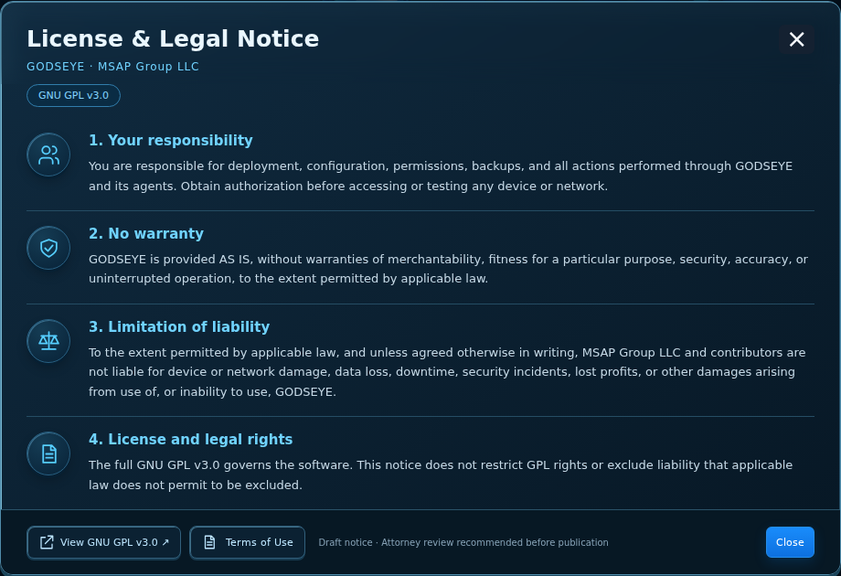
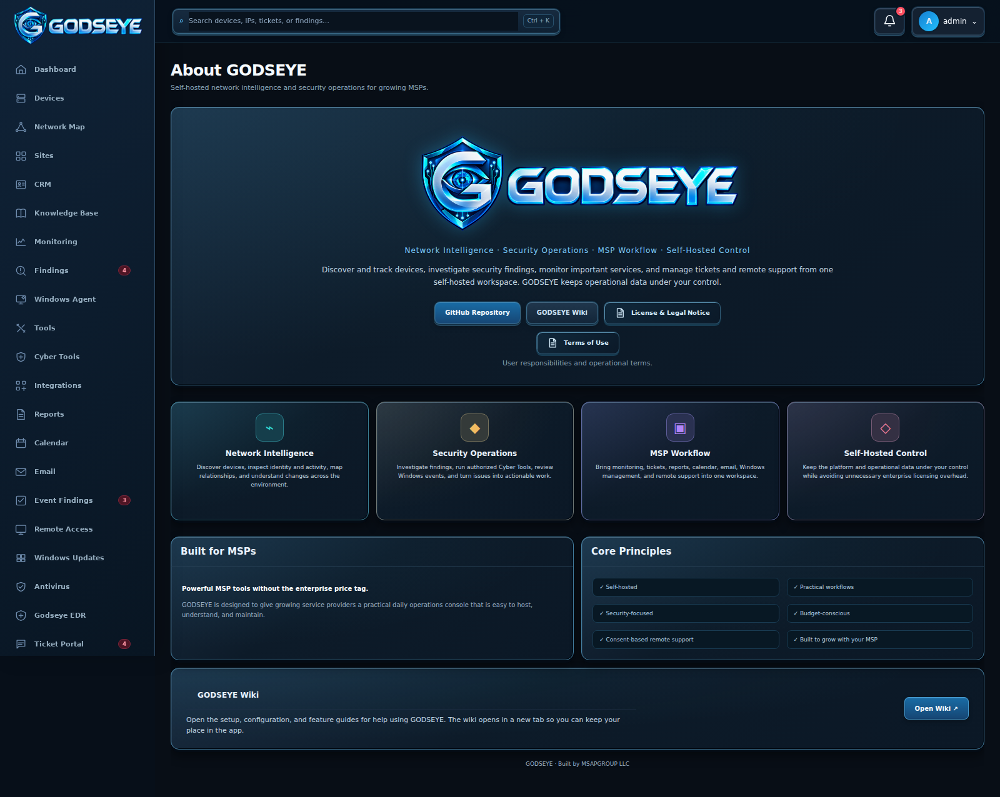

# About-page legal notices

The About page includes two informational cards in the same blue 3D style as GODSEYE.

## License & Legal Notice

Select **License & Legal Notice** beside **GODSEYE Wiki**. The card explains responsibility for deployment and authorized access, the warranty disclaimer, the limitation of liability, and the relationship to the GNU GPL v3.0.

## Terms of Use

Select **Terms of Use** beneath the three main About links. This second card covers authorized use and account security, ownership and handling of data, backups, scans and remediation, third-party tools, support agreements, warranties, liability, and GPL rights.

The text is original GODSEYE wording for MSAP Group LLC. Microsoft does not provide or endorse these notices.

## Controls

- **View GNU GPL v3.0** opens the complete bundled `LICENSE` in a new tab; Internet access is not required.
- The second button in each card switches to the other notice.
- **Close**, **×**, **Escape**, or a click outside the card dismisses it and returns keyboard focus to the original About button.
- **Tab** and **Shift+Tab** keep focus within the open card. On small screens, scroll the body while the closing controls remain available.

The notices are available to all users who can open About. They add no acceptance gate, change no role permissions, and do not modify the server or Windows Agent's operational behavior.

## Legal effect and license precedence

These notices do not guarantee enforceability or immunity from every claim. Liability exclusions apply only to the extent permitted by applicable law and may be affected by a separate written agreement. The full GNU GPL v3.0 in [LICENSE](../LICENSE) governs the software. These notices do not impose additional restrictions on GPL rights or exclude liability that applicable law does not permit to be excluded. Third-party components retain their respective licenses.
