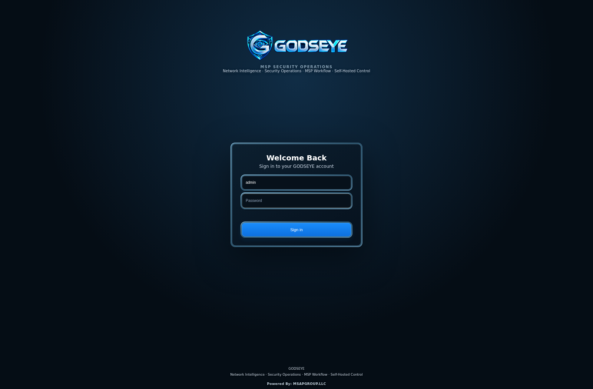
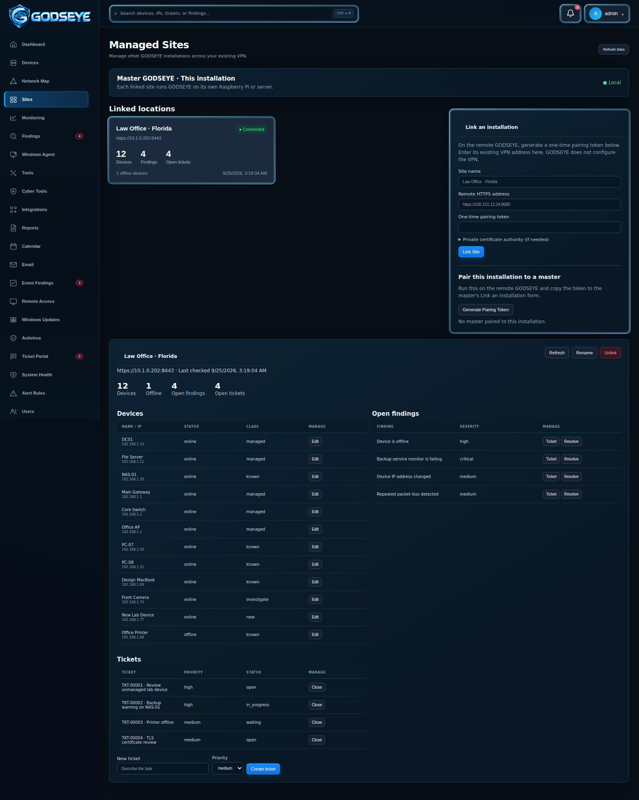
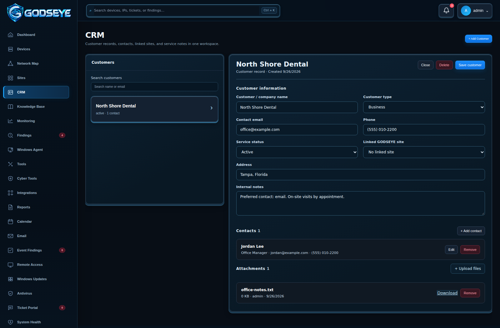
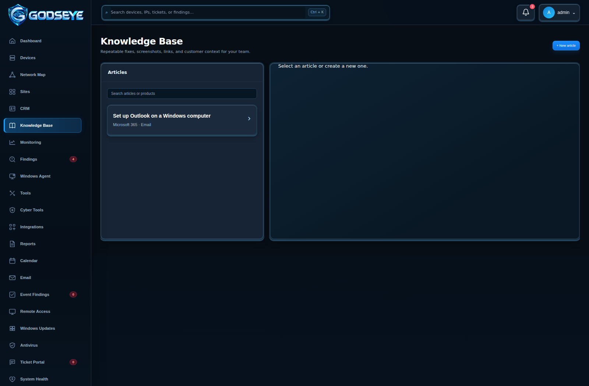
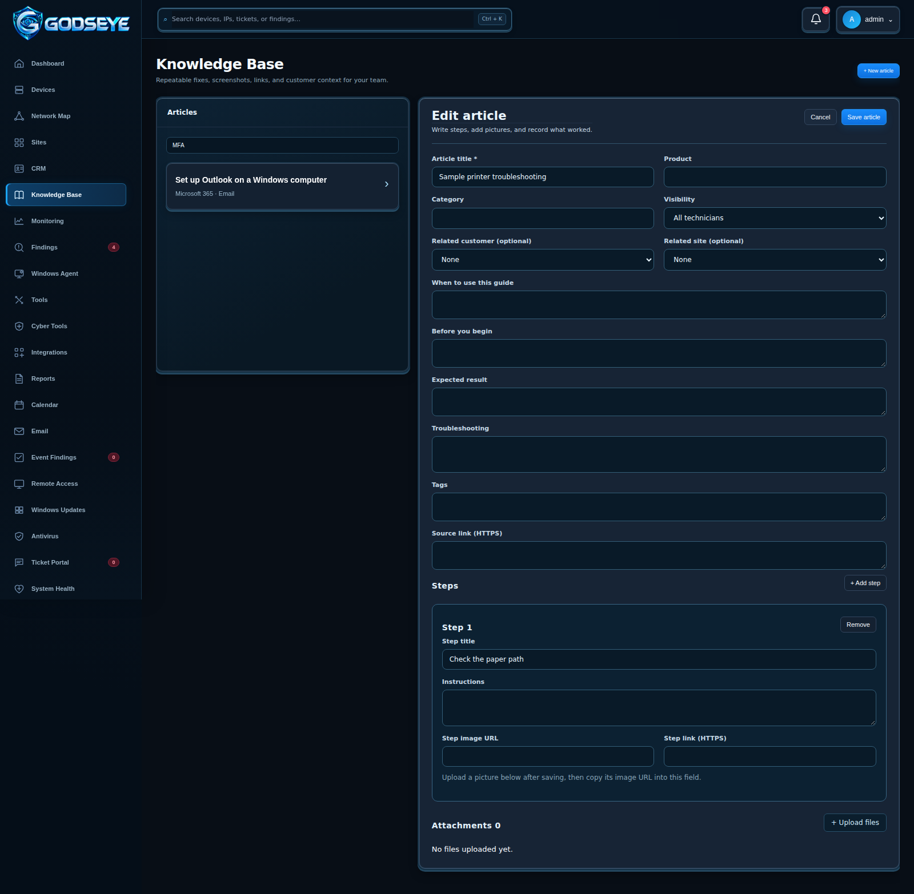

# GODSEYE screen gallery

The original application states were captured from a running GODSEYE instance with the repository's automated UI capture workflow. The card, search, and login borders were visually refreshed from those captures to show the continuous rim treatment. The CRM image was captured from the running app with a saved sample customer. Run `scripts/capture_ui.py` with a browser to recapture the installed build directly.

## Sign in

Sign in to manage network devices, investigate findings, coordinate service work, and control your self-hosted environment.

## Dashboard

Review device totals, findings, monitored services, tickets, traffic, alerts, and the Network Map overview from one operator workspace.

## Devices

Search and filter network assets, discover the network, add authorized devices, select a device for details, and review recent device activity.

## Network Map

Inspect observed device relationships and move from the visual map into the related inventory records.

## Sites

The capture pairs two running GODSEYE instances over HTTPS and opens the remote location card. On a remote installation, generate a one-time token in Sites; on the master, enter its VPN-reachable HTTPS address, a name, and the token. Open its card to manage devices, findings, and tickets. Add a trusted PEM certificate when the remote uses a private CA. Revoke the paired master on the remote installation to end access.

## CRM

Open **CRM** in the sidebar. Click **Add Customer**, enter the name and details, optionally select a linked GODSEYE site, then save. The new customer card closes after a successful save; select the saved card from the list to open it again. Use **Add contact** to record each person's name, role, email, and phone. Search by customer name or email. Operators and administrators can edit; administrators can delete. Use **Upload files** to attach pictures and documents to saved customers, and **Download** or **Remove** to manage them. The capture includes a sample text attachment. This capture shows a saved sample record from the running app; CRM reads and writes records in the local GODSEYE database.

## Knowledge Base

Open **Knowledge Base** and search for a keyword in article content or steps. Choose the seeded Outlook setup guide to read its numbered steps and illustrated images. Select **New article** to write a guide, then save and upload pictures. In **Edit article**, use **Copy image URL** on an uploaded picture to add it to a numbered step. Administrators can delete old articles, including their uploaded files.

Fill in the article title, product, optional customer/site, description, prerequisites, steps, troubleshooting, and official source links. Save to enable attachments. Each image is an illustration of the Outlook flow; consult the linked Microsoft article for the current product UI.

## Calendar

Plan maintenance and ticket work with Month, Week, Day, or List views and supported calendar connections.

## Email

Connect a supported mailbox, browse messages, reply, and share generated GODSEYE reports from the operational workspace.

## System Health

Review web service, scanner, database, backups, notifications, integrations, CPU, memory, disk, storage, network activity, uptime, retention, updates, services, and logs.

## Remote Access

Select an enrolled online Windows computer, request a consent-based screen-sharing session, and separately request control when needed.

## Windows Event Findings

Review collected Windows events, open Suggested Fix guidance, recheck the condition, resolve the finding, or create a linked ticket.

## Cyber Tools

Run bounded, authorized security and diagnostic checks from eight focused tool cards.

## Cyber Tools result and history

Review structured results and scan history, create Findings or Tickets where supported, export results, or schedule recurring supported checks.

## About GODSEYE

The About workspace explains GODSEYE's network intelligence, security operations, MSP workflows, and self-hosted control, with links to setup and technical documentation.
