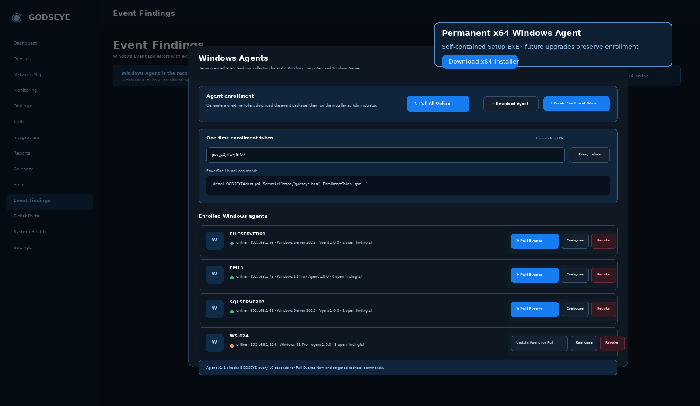
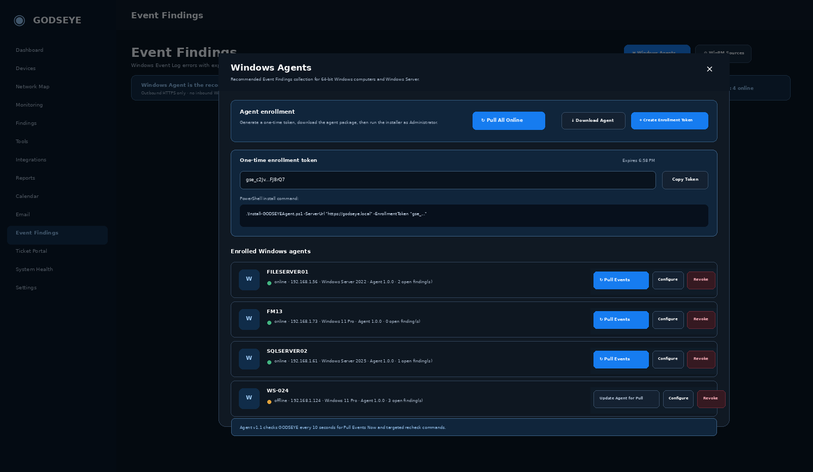
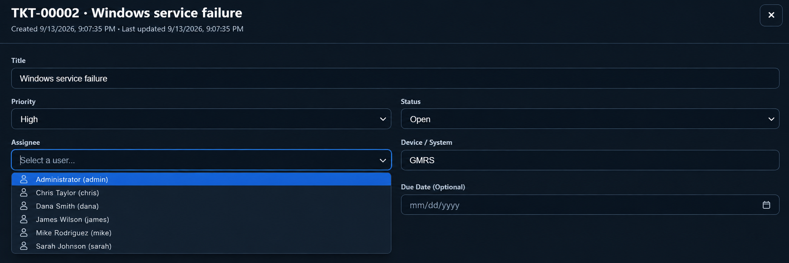

# GODSEYE Dark Mode Screenshots

This release contains **only the current dark-mode screenshot set**. Legacy light-mode and pre-dark-mode UI screenshots have been removed from the package.

## Full Application Overview

## Individual Dark Mode Screens

### Dashboard

### Network Map

### Devices

### Findings

### Monitoring

### Integrations

### Calendar

### Email

### Permanent x64 Windows Agent

### Event Findings

### Windows Agent — Pull Events Now

### Remote Access — Connected Session and Approval Flow

The Remote Access screenshot documents the current Agent 2.2.2 workflow: select an online Windows computer, approve the request on the client, begin the connected remote session, and confirm the GODSEYE Agent tray application is running.

### Ticket Portal

### Ticket Assignee Picker

### Network Tools

### Reports

### System Health

## Header Help Pop-out

The screenshot pack is refreshed when major GODSEYE UI changes are released so documentation does not fall back to older light-mode artwork. New user-facing application screens and major UI features should include an updated screenshot in this set when they are added.
