# GODSEYE Dark Mode Screenshots

This release contains **only the current dark-mode screenshot set**. Legacy light-mode and pre-dark-mode UI screenshots have been removed from the package.

## Full Application Overview

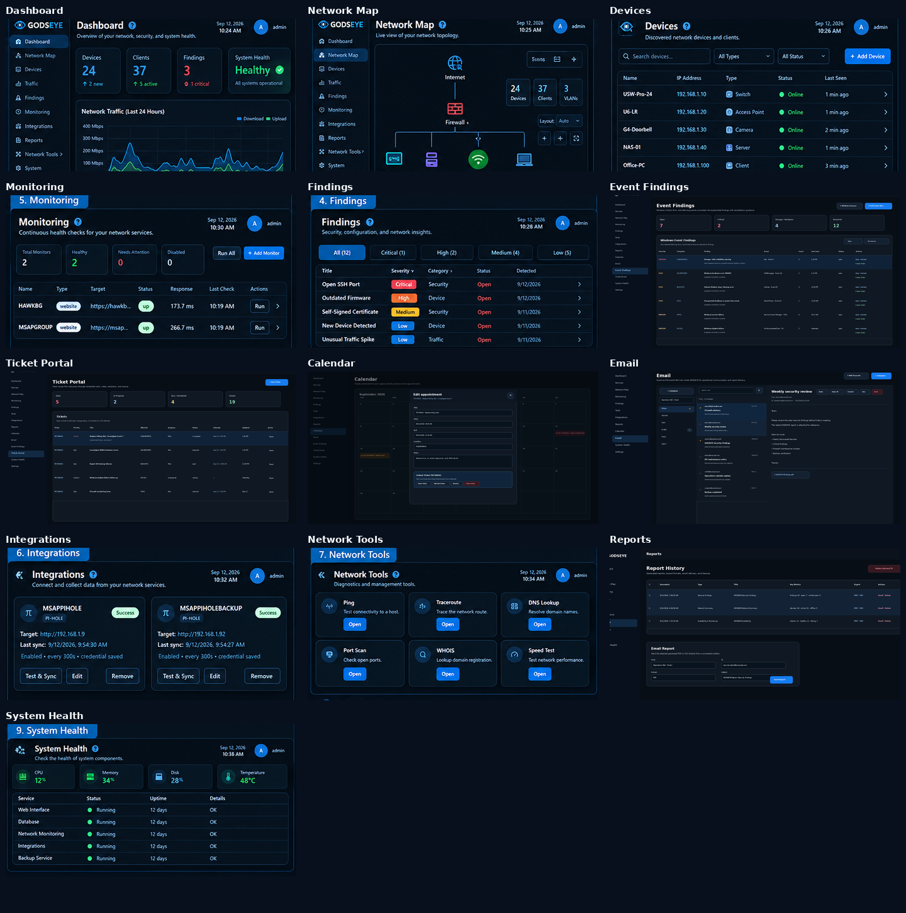

## Individual Dark Mode Screens

### Dashboard
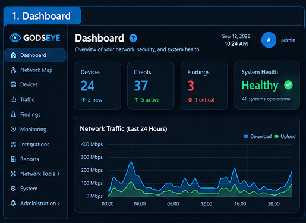

### Network Map
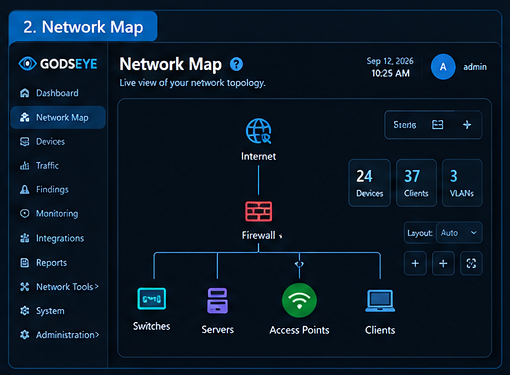

### Devices
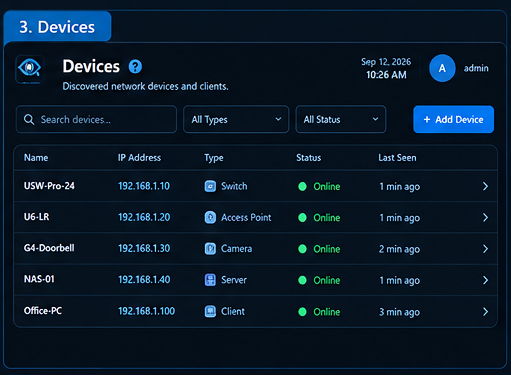

### Findings
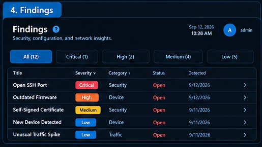

### Monitoring
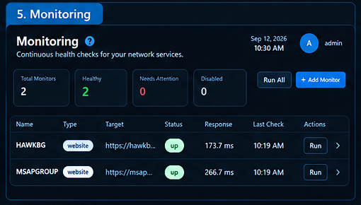

### Integrations
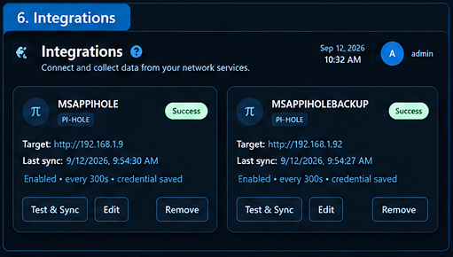

### Calendar
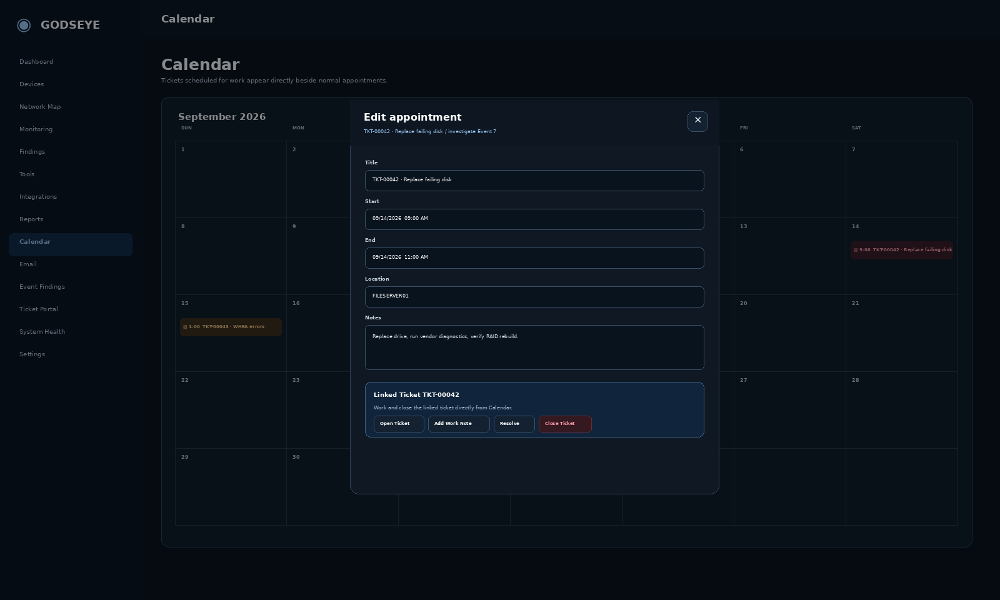

### Email
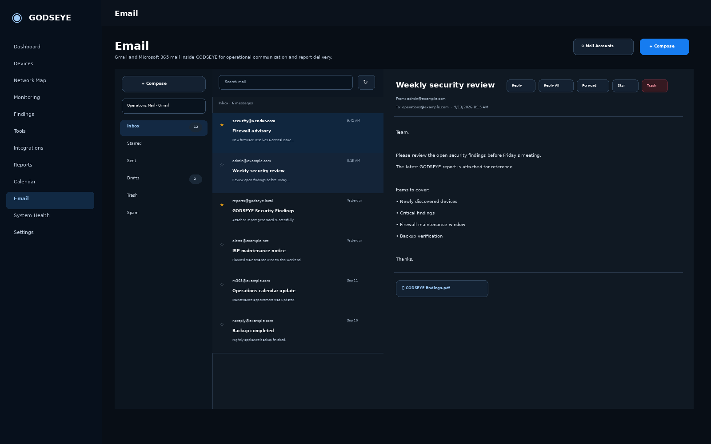

### Event Findings
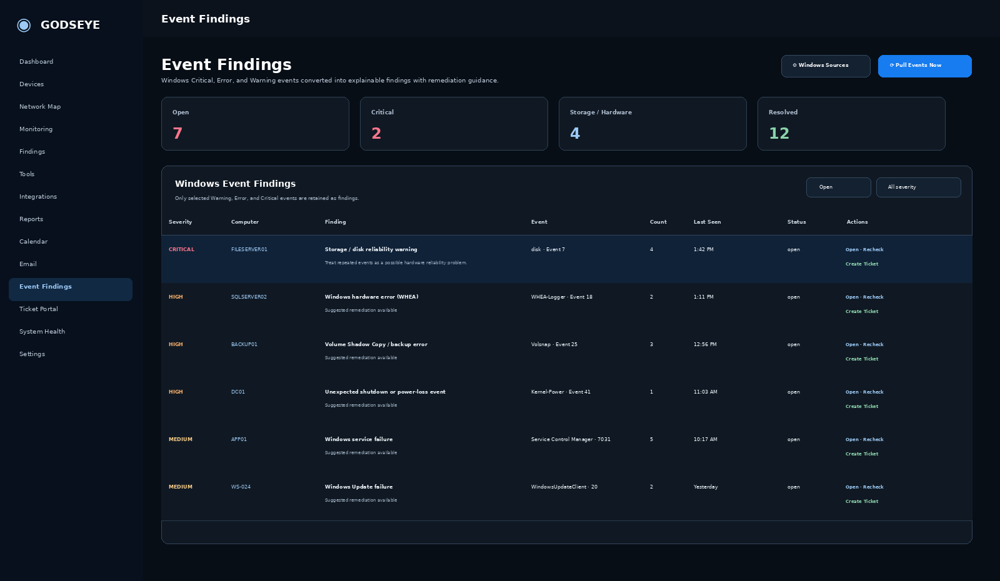

### Ticket Portal
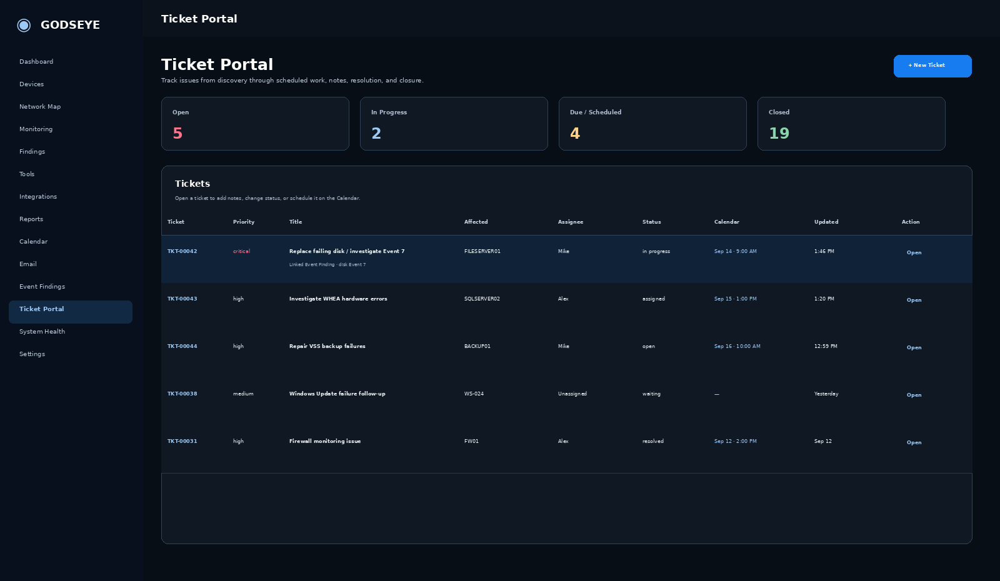

### Network Tools
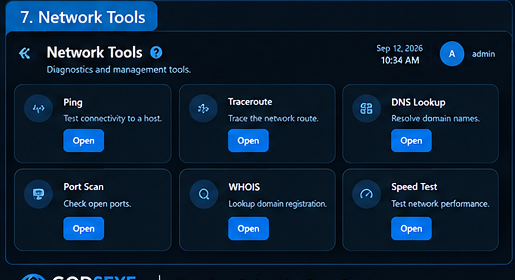

### Reports
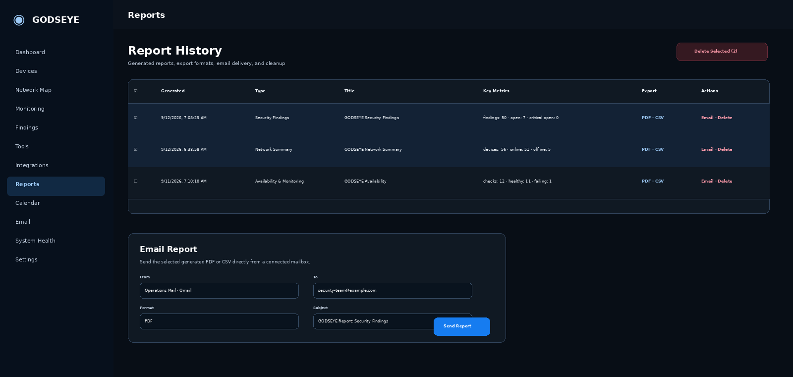

### System Health
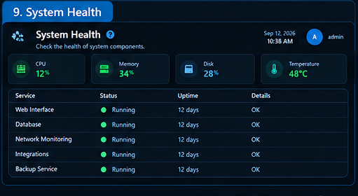

## Header Help Pop-out

The screenshot pack is refreshed when major GODSEYE UI changes are released so documentation does not fall back to older light-mode artwork.
