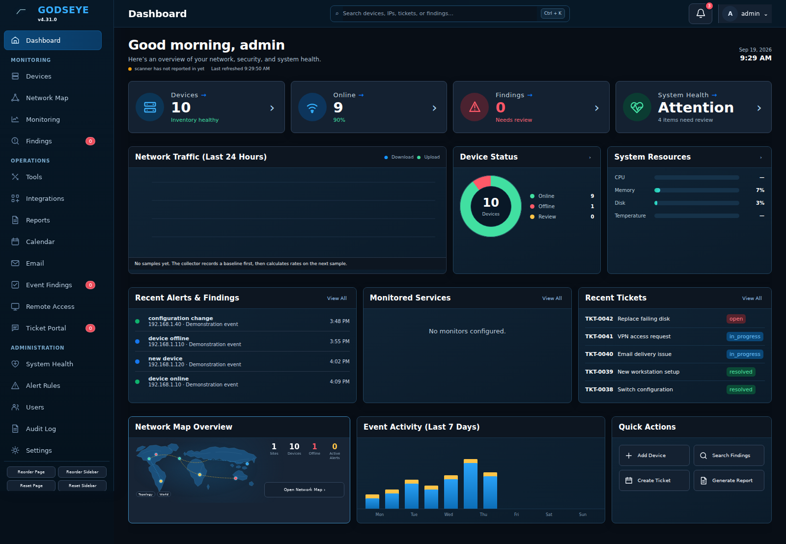
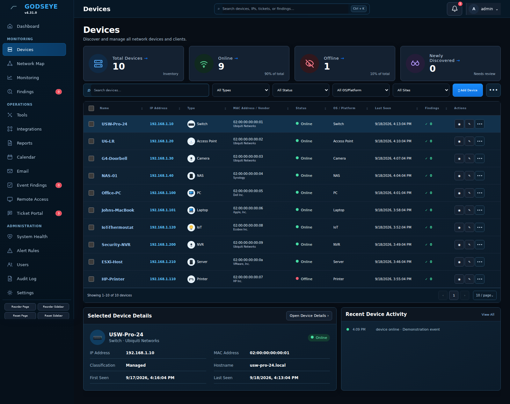
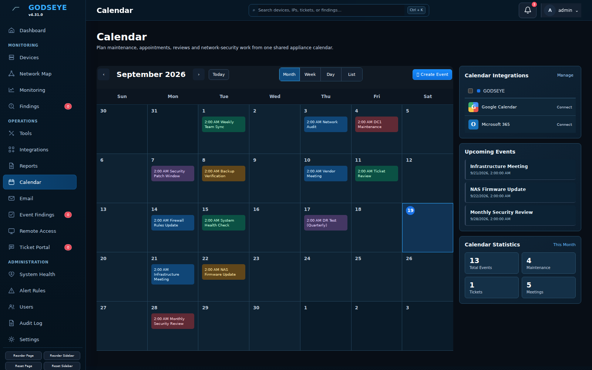
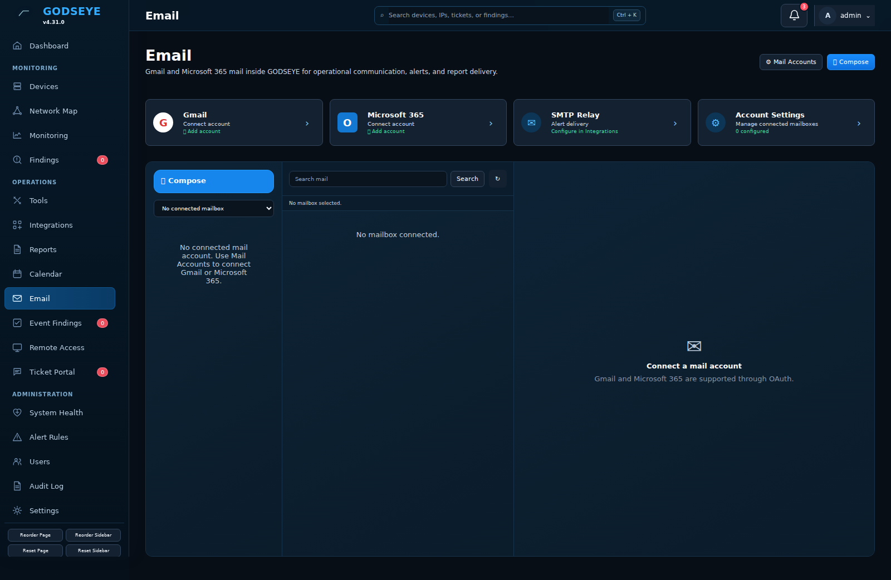
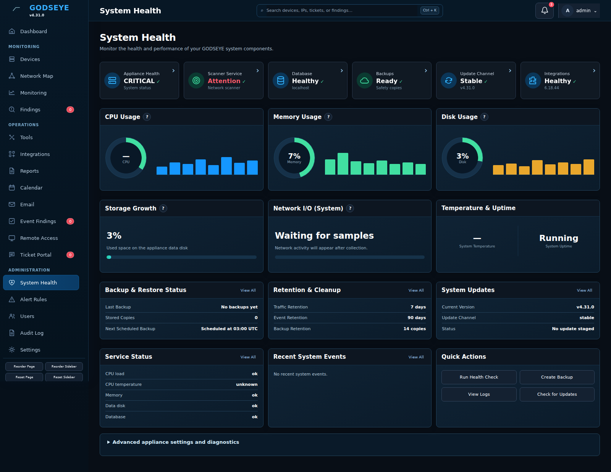
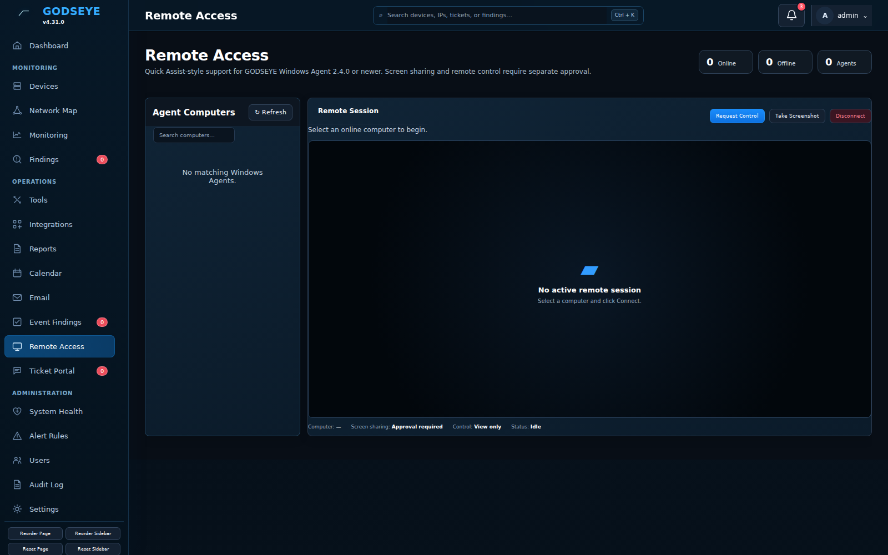

# GODSEYE v4.31 Screenshots

These screenshots are captured from the actual GODSEYE v4.30 web application using a disposable demonstration database. The demonstration records are used only while capturing documentation images and are **not** included in a GODSEYE installation. Email has no connected mailbox and Remote Access has no enrolled Agent in this capture; those pages show their real setup states.

The five user-approved visual targets are separately stored under `design-reference/` as `dashboard-target.png`, `devices-target.png`, `calendar-target.png`, `email-target.png`, and `system-health-target.png`. Those are design references, not photographs of the running application.

## Cyber Tools operations console

The Cyber Tools screens below are current v4.31 UI previews generated from the finalized card layout. The first shows all eight independent tools; the second shows a completed Endpoint Security Posture result and the Finding, Ticket, Export, schedule, and history workflow. Tool availability badges are populated dynamically on the installed appliance.

## Dashboard

## Devices

## Calendar

## Email

## System Health

## Remote Access

## Additional operational screens

The release also retains earlier running-app captures for [Network Map](screenshots/dark-network-map.png), [Monitoring](screenshots/dark-monitoring.png), [Findings](screenshots/dark-findings.png), [Integrations](screenshots/dark-integrations.png), [Reports](screenshots/dark-reports.png), [Event Findings](screenshots/dark-event-findings.png), [Ticket Portal](screenshots/dark-ticket-portal.png), [Network Tools](screenshots/dark-network-tools.png), [Windows Agent](screenshots/dark-windows-agent.png), and [Windows Agent Installer](screenshots/dark-windows-agent-installer.png). The `v430-*` images above are the current running-app captures; the `dark-*` images are earlier captures, and the separate `design-reference/` images are the approved visual targets.
