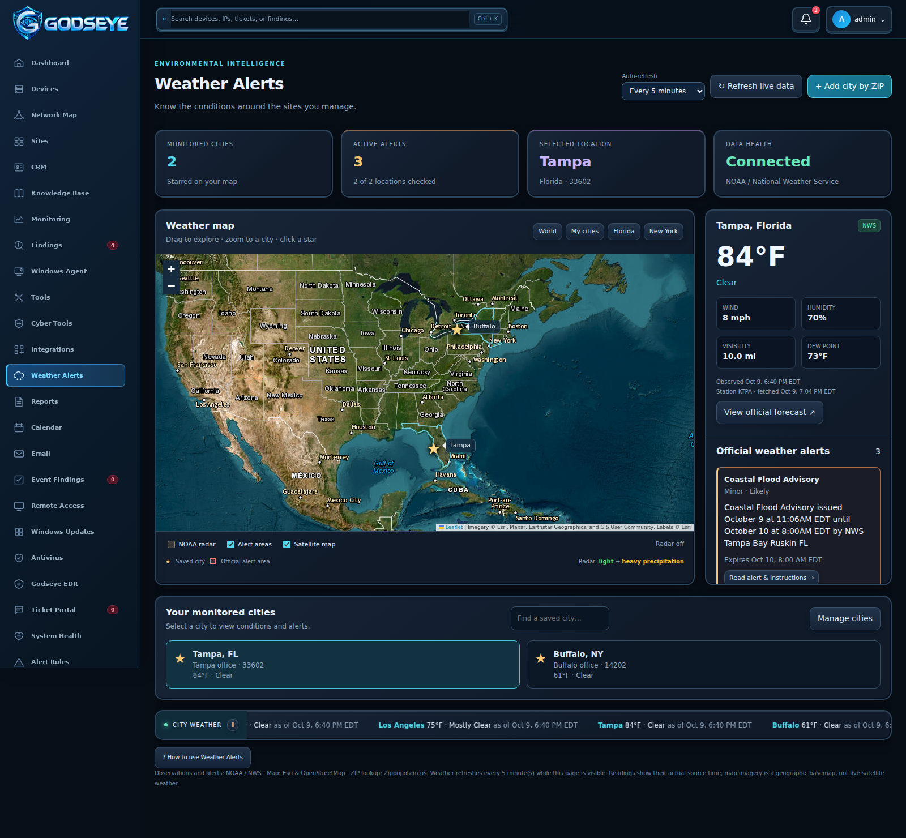
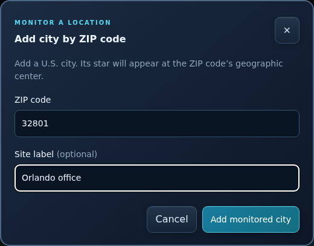

# Weather Alerts

Weather Alerts adds a geographic view of the locations you manage, with current station observations, official NOAA / National Weather Service alerts, radar, and a major-city weather ticker.

## Open a location

Choose **Weather Alerts** in the sidebar. Select **Florida**, then the **Tampa** star, or **New York**, then **Buffalo**. You can also select a city card. Drag the map, zoom, or select **World** and **My cities** to change the view. Satellite is a geographic basemap, not a live cloud image.

The selected card shows temperature, wind, humidity, visibility, dew point, station identifier, and actual observation time. Reports older than two hours are labeled. **View official forecast** opens the NWS forecast for that location.

## Add and remove cities

Select **Add city by ZIP**, enter a five-digit U.S. ZIP code, optionally name the site, and select **Add monitored city**. Successful saving closes the card and adds a star at the ZIP code's approximate geographic center. Close, Cancel, Escape, and clicking outside the card dismiss it. Failed saves keep the form open.

**Manage cities** exposes remove buttons. Select **Done managing** when finished. Each user has their own list, initially Tampa and Buffalo. Up to 25 locations can be monitored. Lists are stored in the app database and included in full application backups.

## Choose your refresh time

The **Auto-refresh** dropdown offers 1, 2, 5, 10, 15, or 30 minutes, one hour, or **Off · manual only**. Your choice is saved to your account. **Refresh live data** works at any time. Refresh stops when you leave Weather Alerts or sign out, and automatic updates run only while the page is visible.

Changing the refresh interval is a personal preference available to users who can view Weather Alerts. Adding and removing cities requires **Full** Weather Alerts permission. Admins can grant **Full**, **Read**, or **None** under the existing sidebar permission settings. The API enforces those permissions as well.

## Map layers and ticker

- **NOAA radar** overlays the latest CONUS reflectivity image. Radar availability and errors appear below the map; the overlay is not an animated forecast.
- **Alert areas** shows polygons supplied by official alerts affecting monitored cities. Some alerts have no geometry and still appear in the alert card.
- **Satellite map** switches between geographic imagery and a street map.
- The bottom ticker shows the latest observations for Tampa, Buffalo, New York, Miami, Chicago, and Los Angeles. Pause or resume its movement with the adjacent button. Reduced-motion preferences stop automatic ticker movement.

Open an alert to read its severity, effective time, expiration, description, and instructions. No active alerts is shown only after a successful check. Missing observations and failed alert requests are labeled unavailable.

## Sources and connectivity

The GODSEYE server retrieves data from fixed public provider endpoints, with bounded caching and timeouts. No weather API key is needed for this implementation. Users do not need direct access to the weather API hosts. The server needs outbound HTTPS access to:

- NOAA / NWS: `api.weather.gov`, `opengeo.ncep.noaa.gov`
- ZIP lookup: `api.zippopotam.us`
- Geographic imagery and labels: `services.arcgisonline.com`
- Street map tiles: `tile.openstreetmap.org`

Sources: [NWS API](https://www.weather.gov/documentation/services-web-api), [NOAA radar services](https://opengeo.ncep.noaa.gov/geoserver/www/index.html), [ZIP lookup](https://zippopotam.us/). Map attribution remains visible. Local Leaflet files retain their license notice; state outlines come from the PublicaMundi MappingAPI U.S. state dataset.

These screenshots show the running app with real weather source responses at capture time; weather and alert values naturally change afterward. The app logo, Windows Agent 2.4.5, original dashboard, and existing operational workflows are preserved.
